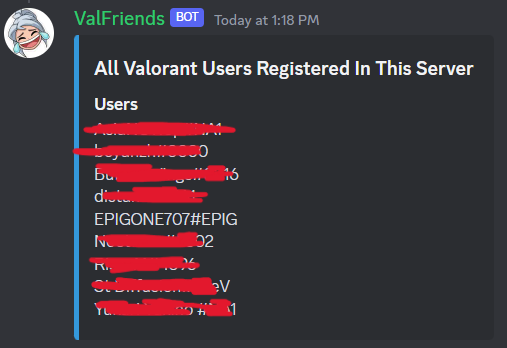
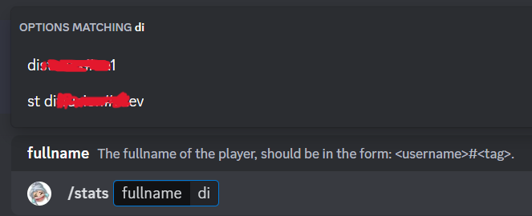

# ValFriends
[](#)
[](#)

A Discord bot for game Valorant, aims for helping you play with your friends happily. 

Just need a simple command to register your valorant account into the user list. You can easily view stats and rank info for everyone in the discord server. 


## Installation

Download and run:
```
python3 main.py
```

You need to set environment variables `SERVER_ID` and `TOKEN`(discord bot token) by creating an `.env` file. You can refer to `.env.example`.

We provides `keep_alive.py` in case you want to host the bot on [replit](https://replit.com/~).

## Basic Usage
Originally, the user list is empty. You can add your valorant account to the user list by executing:
```
/stats <valorant_name>#<valorant_tag>
```
This command also prints user stats. For example:


You can also ask your friends to register their valorant accounts.

To view the user list, execute:
```
/userlist
```



When you execute commands that require username as input, like `stats`, it will autocomplete based on user input:




To print users in sorted order of current rank, use `/crank`.

To print users in sorted order of lifetime highest rank, use `/hrank`.

To print stats for all users, use `/allstats`

Note that the profile for every user in the user list is cached in a sqlite database. When you execute `stats`, the bot actually returns the data in cache. 

The bot generates a timestamp for every profile. The profile will expire after some time and the bot will fetched the up-to-date data from the API. 

You can also force the cache to update by using `/expire <valorant_name>#<valorant_tag>` or `/allexpire`.


## All Commands
Execute `/help` to get the help message for all supported commands:
```
crank - Print users who have highest current rank in the user list.
hrank - Print users who have highest lifetime rank in the user list.
help - Print information for commands
allexpire - Force expire all user's stats.
delete - Delete a user from the user list of this server (admin only).
review - Give a fair and objective review of a game.
hello - Responds with 'Hello World'. Used for testing.
stats - Get user's stats.
userlist - Print user list.
allstats - Get all users' stats.
expire - Force expire user's stats.
alldelete - Delete all users from the user list of this server (admin only).
```
You can also execute `help <command>` to view the details of the command parameters.


## API reference
A big thank you to [Henrik](https://github.com/Henrik-3/unofficial-valorant-api)!

## Contributors
- [@BoYanZh](https://github.com/BoYanZh)
- [@Yijie-Shi0829](https://github.com/Yijie-Shi0829)
- Me!
